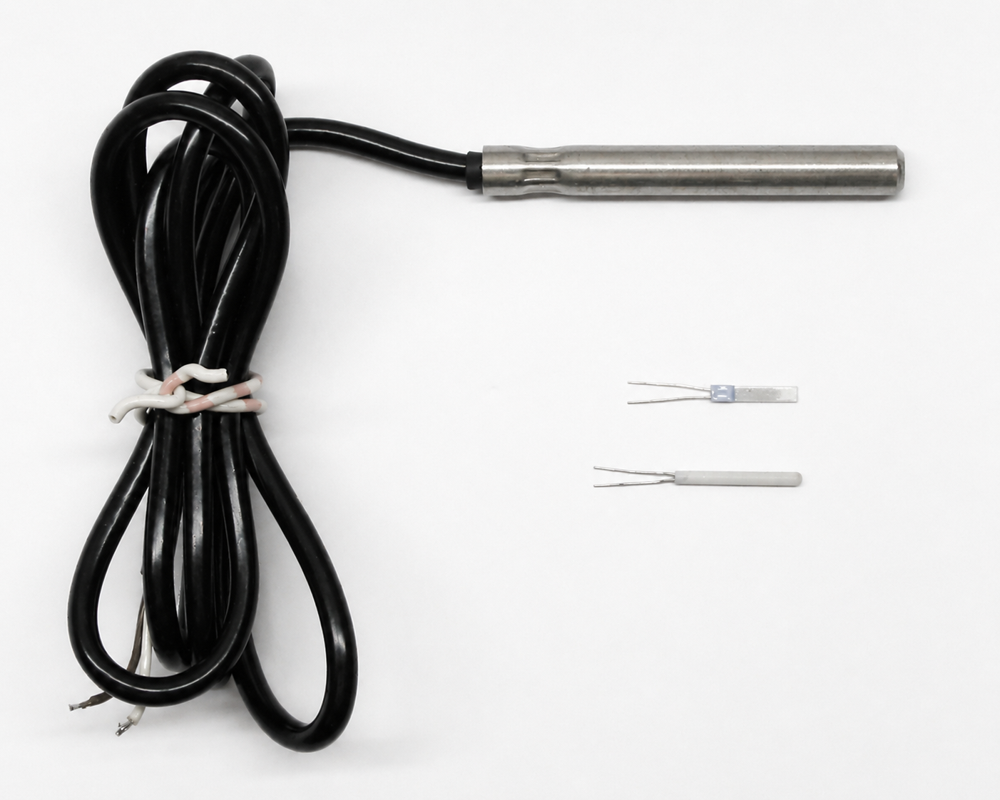

# Learn rtd-sensor

## What is rtd-sensor?
`rtd-sensor` is a Python library that turns RTD resistance values into temperatures, and
temperatures back into expected resistance values. It supports common platinum
RTDs such as Pt100, Pt500, Pt1000, and several nickel sensor types. It also provides
tools for calibration, custom sensor models, tolerance, uncertainty, simulation, and
working with many readings at once.

## What rtd-sensor is not
`rtd-sensor` does not read a physical RTD directly. Hardware such as a MAX31865 or another
measurement circuit must first determine the sensor’s resistance, and your hardware or
acquisition software must pass that resistance to `rtd-sensor`. `rtd-sensor` handles the
RTD science and calculations; it does not handle wiring, SPI/I²C communication, ADCs, or
other sensor-interface hardware.

## Let's Go!

Ready to dive in and use `rtd-sensor` in research, engineering, or in a
professional or hobby project? Start with the complete user documentation:

[Full rtd-sensor Documentation](documentation/index.md)
{ .md-button .md-button--docs }

**Or learn RTDs by experimenting. No hardware is required to start.**

The RTD Playground, for beginners to intermediate users, begins with only Python and
`rtd-sensor`. Later exercises will add a real Pt100, a multimeter, a MAX31865,
and a Raspberry Pi.

[Visit the RTD Playground](playground/index.md)
{ .md-button .md-button--primary }

## Start with a Pt100

A **Pt100** is a platinum RTD whose ideal resistance is 100 ohms at 0 °C. In the
first experiment, Python acts as the measurement lab: you ask what resistance a
Pt100 should have at different temperatures and then run the calculation in
reverse.

[Start your first Pt100 experiment](experiments/first-pt100-experiment.md)
{ .md-button .md-button--primary }

{ width="400" loading=lazy }

/// caption
Three different Pt100 temperature sensors. Color-corrected from
[*Pt100 Sensors.png* by dirkhb](https://commons.wikimedia.org/wiki/File:Pt100_Sensors.png),
released into the public domain.
///

## Where the RTD Playground goes

The beginner-to-intermediate exercises will gradually move from software-only
exploration to real hardware:

1. calculate Pt100 resistance and temperature;
2. plot an RTD curve;
3. test whether a Pt100 is really linear;
4. compare Pt100, Pt500, and Pt1000 sensors;
5. measure a real Pt100 with a multimeter;
6. connect a MAX31865 and Raspberry Pi;
7. explore calibration, tolerance, uncertainty, and portable models;
8. go deeper into cross-language and embedded RTD implementations.

[Visit the RTD Playground](playground/index.md)
{ .md-button .md-button--primary }

!!! note "Two ways to use this site"
    If you already know Python and want to use the package, begin with
    [Start Here](start-here.md) or the [full documentation](documentation/index.md).
    If you want a more detailed, experiment-driven introduction, use the
    [RTD Playground](playground/index.md).
